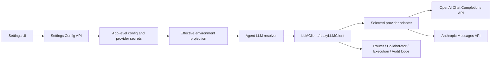

# First-Party OpenAI and Claude Providers Technical Design

> Status: implemented
> Last Updated: 2026-07-24
> Feature Plan: [First-Party OpenAI and Claude Providers](./first-party-openai-claude-providers.md)
> Related Contract: [Settings First-Run API Contract](../../engineering/settings-first-run-api-contract.md)
> Usage Contract: [Token Usage Analytics Contract](../../engineering/token-usage-analytics-contract.md)
> Related Architecture: [LLM Provider Reliability](../../architecture/llm-provider-reliability.md)
> Scope: Plato app-level Settings, provider construction, OpenAI and Anthropic transports, Agent loop compatibility

---

## 1. 设计摘要

本方案把 OpenAI 和 Claude 接入为 Plato 的一等 LLM provider，但不改变 Agent
loop 已经使用的 OpenAI-shaped 消息合同。

核心边界如下：



设计结论：

1. `LLMClient` 继续作为上层唯一 facade。
2. `ChatRequest` / `ChatResponse` 继续保持当前 OpenAI-shaped loop contract。
3. OpenAI adapter 只负责 OpenAI SDK transport 和 response normalization。
4. Claude adapter 独占 Anthropic 协议转换；Router、Agent loop 和 Settings 不感知
   `tool_use` / `tool_result`。
5. provider catalog 是 provider ID、显示名、key 环境变量和默认 endpoint 的单一事实源。
6. Settings 继续是 app-level 配置；本方案不增加 workspace、session 或 Agent 级 UI。
7. provider secret 按 provider 独立保存，切换 provider 不覆盖其他 provider 的 key。
8. SDK 内部重试关闭，统一由 `BaseLLMProvider` 管理，避免双重重试。
9. Settings readiness 只做本地确定性检查，不发起真实计费请求。
10. 先对 Settings 后端和前端大文件做零行为拆分，再完成 Claude 接入。
11. 两个新 provider 都必须把总 token 和 provider 报告的缓存命中 token 投射到
    `LLMUsage`，并进入现有 usage ledger。

---

## 2. 当前代码事实

本节描述 2026-07-24 当前工作树，而不是目标状态。

### 2.1 已有稳定基础

| 模块 | 当前事实 |
|---|---|
| `src/taskweavn/llm/contracts.py` | 已有 `ChatRequest`、`ChatResponse`、`ToolCall`、`LLMUsage`、`RetryPolicy` 和 provider capability |
| `src/taskweavn/llm/retry.py` | `BaseLLMProvider` 已统一执行 retry、backoff 和错误分类 |
| `src/taskweavn/llm/client.py` | `LLMClient.chat()` 已委托 provider；`LazyLLMClient` 在首次调用时解析配置 |
| `src/taskweavn/core/loop.py` | Agent loop 把 `raw_assistant_message` 写回 history，并用 OpenAI-shaped `role=tool` 返回 observation |
| `src/taskweavn/task/collaborator_profile_runner.py` | Collaborator 同样依赖 OpenAI-shaped assistant tool call 和 tool result |
| `src/taskweavn/llm/agent_resolver.py` | Settings-backed resolver 已支持按 Agent profile 解析 provider 配置 |
| `src/taskweavn/usage/recording.py` | 已把 `ChatResponse.usage` 归一化为一条 logical usage event，并能补算 input + output 总量 |
| `src/taskweavn/usage/store.py` | 已支持 Workspace、Session、Plan 和 Task 的 total/cache 聚合 |
| Settings API | 已有 GET、PATCH 和 readiness recheck，不需要新增 endpoint |

当前生产调用点使用 `chat()`。`complete()` 和 `count_tokens()` 仍保留 OpenHands
兼容实现，但没有发现业务调用方直接依赖它们；只有 usage recorder 和 resolver 继续
透传这两个方法。

### 2.2 当前工作树中的未完成草案

| 能力 | 当前状态 | 主要缺口 |
|---|---|---|
| provider catalog | 已加入 `openai`、`claude` 元数据草案 | 需要所有 Settings 分支真正改为 catalog-driven |
| OpenAI provider | 已有官方 SDK adapter 草案，parser 能读取标准 cached tokens 和部分兼容 cache hit/miss 字段 | 需要关闭 SDK retry、在 adapter 层补算缺失 total，并补 usage ledger 测试 |
| Claude provider | 已有 Anthropic Messages adapter 草案，能读取 input/output/cache-read | 协议转换与 transport 混在一个文件，且把 cache creation 错误映射成 cache miss |
| Settings backend | OpenAI Base URL 路径已开始接入 | 更新、校验和 readiness 仍硬编码 `provider == "openai"` |
| provider secret | 已能读取未来 `llmProviders` map | 写入和 effective env 仍使用旧的单 active-provider secret |
| Settings frontend | 已开始支持 OpenAI | provider union、fallback metadata 和表单显示仍不支持 Claude |
| token usage ledger | 事件、SQLite、聚合和 API 已存在 | 不需要新增统计系统，只需要新 provider 正确返回 `LLMUsage` |
| tests | 已加入部分 OpenAI 测试 | Claude protocol、secret migration、UI、loop 和 total/cache usage 测试缺失 |

这些草案不能直接视为功能完成。尤其是 secret 读写不对称时，切换 provider 仍可能
丢失或忽略先前保存的 key。

### 2.3 维护性热点

| 文件 | 当前规模 | 风险 |
|---|---:|---|
| `src/taskweavn/server/settings_config.py` | 约 1,200 行 | API model、存储、secret、验证、env projection 和 Web Search 混合 |
| `frontend/src/pages/settings/SettingsRoute.tsx` | 约 1,200 行 | 数据加载、表单状态、LLM、日志、诊断和数据管理混合 |
| `frontend/src/shared/api/platoApi.ts` | 约 1,100 行 | 大型共享 API contract，但本次只需窄类型扩展 |
| `src/taskweavn/llm/providers/claude.py` | 约 300 行草案 | transport、request conversion、response parsing 和 usage conversion 混合 |

因此本特性不能继续把 provider 分支直接堆入前两个热点文件。

---

## 3. 目标与非目标

### 3.1 技术目标

1. OpenAI 和 Claude 都通过官方 Python SDK 执行 `chat()`。
2. 两个 provider 都支持多轮文本、function tools、tool result 和后续生成。
3. Settings 可以保存 provider、Base URL、model 和 write-only API key。
4. Settings、readiness、运行时构造和前端显示使用同一 provider catalog。
5. provider 切换后，新创建或尚未解析的 `LazyLLMClient` 使用新配置。
6. 失败以已有结构化 LLM error 和 Settings field error 返回，不静默 fallback。
7. 日志能定位 provider、model、endpoint、request ID、retry 和 usage，但不记录 key。
8. OpenAI 和 Claude 的成功响应进入现有 Workspace、Session、Plan 和 Task token
   聚合，至少提供 total token 和 provider-reported cache hit token。

### 3.2 非目标

- 不改用 OpenAI Responses API；
- 不支持 Anthropic extended thinking；
- 不支持 multimodal content block；
- 不实现跨 provider fallback；
- 不实现 provider 或 model 自动发现；
- 不做真实网络 readiness probe；
- 不为每个 provider 保存独立 model 和 Base URL；
- 不增加 workspace、session 或单 Agent 配置入口；
- 不迁移 `complete()` / `count_tokens()` 到两个新 adapter；
- 不重构整个 `platoApi.ts`。

---

## 4. 架构决策

### D1. Loop contract 保持 OpenAI-shaped

当前所有 Agent loop 都已经依赖以下历史结构：

```json
{
  "role": "assistant",
  "content": "",
  "tool_calls": [
    {
      "id": "call_1",
      "type": "function",
      "function": {
        "name": "read_file",
        "arguments": "{\"path\":\"README.md\"}"
      }
    }
  ]
}
```

tool observation 使用：

```json
{
  "role": "tool",
  "tool_call_id": "call_1",
  "content": "{\"ok\":true}"
}
```

本次不引入新的 provider-neutral content block AST。Claude adapter 必须把该合同转换
到 Anthropic Messages API，并把响应再转换回来。

理由：

- 避免修改 Router、Collaborator、Execution、Audit 和 Risk 等多个 loop；
- 避免同一 history 同时出现 OpenAI 和 Anthropic 两种 message shape；
- provider-specific 数据不会泄漏到 EventBus、session store 或 UI；
- 后续若要引入真正 provider-neutral AST，应作为独立架构迁移。

### D2. `chat()` 是本次唯一强制能力

`LLMClient.complete()` 和 `count_tokens()` 继续保留现有兼容路径。本次 provider
capability 只保证：

```text
chat
tool_calls
normalized usage when the provider response reports token counters
```

如果未来业务开始直接调用 `complete()` 或要求 provider-native token counting，应单独
扩展 `LLMProvider` protocol，不能让本次实现暗中返回近似结果。

### D3. provider catalog 是静态元数据事实源

catalog 提供：

```python
provider id
display label
preferred API key env var
fallback API key env vars
Base URL env var
default Base URL
Base URL validation
```

catalog 不保存：

- secret；
- active provider；
- model；
- runtime client；
- provider-specific request policy。

Settings backend、readiness 和前端 contract 都从 catalog 派生，不再出现
`if provider == "openai"` 这种 endpoint 能力判断。应改为：

```python
if base_url_env_var(provider) is not None:
    ...
```

### D4. 单一 retry owner

`BaseLLMProvider` 是唯一 retry owner。官方 SDK client 必须配置：

```python
max_retries=0
```

否则 SDK retry 和 Plato retry 叠加，最多请求次数、等待时间和日志都会失真。

请求级 timeout 继续快速失败，不在同一 Agent step 内自动重放；429、连接错误和允许的
5xx 按 `RetryPolicy` 重试。

### D5. Settings 保存 active config，secret 按 provider 保存

`config.json` 只保存当前生效的：

```text
provider
model
baseUrl
```

`secrets.json` 保存每个 provider 的 API key。切换 provider 时：

- active model 清空并要求用户填写新 provider 的 model；
- Base URL 重置为新 provider 的默认值；
- 新 provider 已保存的 key 可直接复用；
- 其他 provider 的 key 不删除；
- 不自动复制上一 provider 的 model、endpoint 或 key。

这既满足 provider key 保留，也避免把 OpenAI model 或代理 endpoint 错带到 Claude。

### D6. Token usage 是 provider contract

OpenAI 和 Claude adapter 必须在成功 response 中解析 provider usage，并归一化为现有
`LLMUsage`。这是 provider 的正式输出合同，不是日志增强。

最低语义：

```text
input_tokens
output_tokens
total_tokens
cached_tokens
cache_hit_tokens
cache_miss_tokens when explicitly reported
cache_hit_ratio when it can be derived from reported counters
```

规则：

1. provider 报告 `total_tokens` 时直接使用；
2. 未报告 total、但完整 input 和 output 均存在时，adapter 计算两者之和；
3. `cached_tokens` 与 `cache_hit_tokens` 表达被 provider cache 读取并命中的输入 token；
4. `cache_miss_tokens` 只接收 provider 明确声明的 miss counter；
5. Anthropic `cache_creation_input_tokens` 表示写入缓存的 token，不是 cache miss；
6. Anthropic 完整 input 是 `input_tokens + cache_creation_input_tokens +
   cache_read_input_tokens`；
7. provider 未报告 cache 字段时保持 `null`，不能写成 `0`；
8. 不根据 Context Manager stable prefix、本地 tokenizer 或 prompt 长度估算 cache hit；
9. `UsageRecordingLLM` 继续负责把一个成功 logical chat 写成一条 usage event；
10. retry attempts 不重复记账，最终失败不创建成功 usage event。

---

## 5. 目标模块边界

### 5.1 后端

```text
src/taskweavn/llm/
  contracts.py                 shared loop request/response contract
  provider_catalog.py          provider metadata and endpoint validation
  config.py                    effective env -> provider config/factory
  retry.py                     single retry owner
  providers/
    openai.py                  OpenAI transport
    _openai_compat.py          OpenAI response normalization
    claude.py                  Anthropic transport
    _anthropic_compat.py       pure request/response protocol conversion

src/taskweavn/server/
  settings_config.py           gateway orchestration and public API models
  settings_llm.py              LLM summary, validation, env projection,
                               provider secret read/write and migration
  settings_readiness.py        local readiness aggregation

src/taskweavn/usage/
  recording.py                 ChatResponse usage -> one normalized event
  store.py                     Workspace/Session/Plan/Task aggregation
```

`settings_llm.py` 是从现有大文件做的零行为边界提取，不是新领域层。公开 API model
可以继续从 `settings_config.py` re-export，避免路由层和测试一次性大改。

### 5.2 前端

```text
frontend/src/pages/settings/
  SettingsRoute.tsx            route orchestration and tab composition
  SettingsLlmSection.tsx       provider/model/baseURL/key form and safe summary
  settingsViewModel.ts         provider metadata helpers and form mapping

frontend/src/shared/api/
  platoApi.ts                  additive Settings contract types only
```

`SettingsLlmSection` 接收 form、safe summary、provider options、field errors 和
callbacks，不直接调用 API。

---

## 6. 配置模型与生效顺序

### 6.1 Provider catalog

目标 catalog：

| ID | Label | Key precedence | Base URL env | Default Base URL |
|---|---|---|---|---|
| `openai` | OpenAI | `OPENAI_API_KEY`, `LLM_API_KEY` | `OPENAI_BASE_URL` | `https://api.openai.com/v1` |
| `claude` | Claude | `ANTHROPIC_API_KEY`, `LLM_API_KEY` | `ANTHROPIC_BASE_URL` | `https://api.anthropic.com` |

现有 LiteLLM、DeepSeek 和 OpenRouter metadata 保持兼容。

Base URL 统一校验：

- 必须是绝对 `http` 或 `https` URL；
- 禁止用户名和密码；
- 禁止 query 和 fragment；
- 端口必须有效；
- 保存时移除尾部 `/`；
- endpoint-capable provider 不允许空值。

### 6.2 App-level storage

Electron 启动 sidecar 时提供 global settings root，因此产品 UI 中保存的配置是 app
级配置。CLI 未提供 override 时，现有 workspace-local 行为继续作为开发兼容路径。

`config.json` 保持现有公共 schema：

```json
{
  "schemaVersion": "plato.local_settings_storage.v1",
  "updatedAt": "2026-07-24T00:00:00Z",
  "llm": {
    "provider": "claude",
    "model": "claude-model-id",
    "baseUrl": "https://api.anthropic.com"
  }
}
```

这是对现有字段的 additive 扩展，不需要改变 Settings HTTP contract 的
`plato.settings_config.v1`。

### 6.3 Secret schema 与迁移

旧格式：

```json
{
  "schemaVersion": "plato.local_settings_storage.v1",
  "llm": {
    "provider": "openai",
    "apiKey": "secret"
  }
}
```

目标格式：

```json
{
  "schemaVersion": "plato.local_settings_secrets.v2",
  "updatedAt": "2026-07-24T00:00:00Z",
  "llmProviders": {
    "openai": {
      "apiKey": "secret"
    },
    "claude": {
      "apiKey": "secret"
    }
  },
  "webSearch": {
    "provider": "tavily",
    "apiKey": "secret"
  }
}
```

迁移规则：

1. read 先查 `llmProviders[provider]`；
2. 未命中时只回退到 provider 相同的旧 `llm`；
3. 第一次写任意 LLM key 时，把有效旧 key 合并到 `llmProviders`；
4. 写成功后移除旧 `llm`；
5. 保留 `webSearch` 和未知的受支持顶层字段；
6. 继续通过 `_write_private_json` 原子写入并保持私有文件权限；
7. GET、PATCH response、日志和诊断永远不返回 key。

需要新增唯一写入口：

```python
write_llm_provider_secret(
    *,
    provider: str,
    api_key: str,
    updated_at: datetime,
) -> None
```

旧 `write_secret()` 在迁移完成后删除或只保留为调用新入口的兼容 wrapper。

### 6.4 Effective configuration precedence

active provider、model 和 Base URL：

```text
stored app config
  > process environment
  > product default
```

active provider 的 API key：

```text
stored provider-specific secret
  > provider-specific environment variable
  > LLM_API_KEY
  > missing
```

Settings summary 必须准确报告 `stored`、`env`、`default` 或 `none`。secret source
判定、effective env projection 和 Agent resolver 必须调用同一
`read_llm_provider_secret(provider)`，不能继续调用旧 `read_secret()`。

### 6.5 生效时机

`LazyLLMClient` 当前在第一次调用时解析配置并缓存 client。因此：

- 保存设置后，尚未解析的 client 使用新配置；
- 新建 session/runtime/client 使用新配置；
- 已经解析的长生命周期 client 不热切换；
- 已发出的请求不取消、不重放；
- 本 MVP 不增加全局 client invalidation bus。

UI 保存成功时应明确表示配置已保存；运行中 Agent 的热切换属于后续能力。

### 6.6 Agent role inheritance

当前 `agentLlm` backend config 支持 Router、Execution、Collaborator、Inquiry、Audit 和
Summary 等角色覆盖 provider/model profile。该能力没有产品 UI。

本 MVP 的规则是：

- 没有显式 role override 时，所有 Agent 继承 Settings 中的全局 provider 和 model；
- 已存在的 backend-only role override 为开发兼容能力，不由 Settings UI 修改；
- role override 选择其他 provider 时，resolver 可以读取该 provider 的独立 secret；
- 由于 MVP 只保存 active provider 的 Base URL，非 active role override 使用对应
  provider 的环境变量或默认 Base URL；
- Settings safe summary 只描述全局 active provider，不声称展示每个 role 的最终值；
- 后续若给 role override 增加产品入口，需要独立配置合同和可见性设计。

---

## 7. Settings API 设计

沿用现有 endpoint：

```text
GET /api/v1/settings/config
PATCH /api/v1/settings/config
POST /api/v1/settings/readiness/recheck
```

### 7.1 Safe provider options

GET response 中的 provider option：

```json
{
  "id": "claude",
  "label": "Claude",
  "requiredApiKeyEnvVars": ["ANTHROPIC_API_KEY", "LLM_API_KEY"],
  "baseUrlEnvVar": "ANTHROPIC_BASE_URL",
  "defaultBaseUrl": "https://api.anthropic.com"
}
```

前端以 `baseUrlEnvVar != null` 判断是否显示 Base URL，不根据 provider ID 分支。

### 7.2 PATCH request

```json
{
  "llm": {
    "provider": "claude",
    "baseUrl": "https://api.anthropic.com",
    "model": "claude-model-id",
    "apiKey": "write-only replacement"
  }
}
```

语义：

- `apiKey` 缺失：保留当前 provider 已保存的 key；
- `apiKey` 为空且已有有效 key：不修改；
- `apiKey` 为空且无 stored/env key：返回 `llm.apiKey` field error；
- provider/model/Base URL 验证全部通过后才写 config 和 secret；
- config 与 secret 任一写失败时返回结构化 storage error，不返回半成功摘要。

当前文件存储不能提供真正跨文件事务。实现应先验证全部 payload，再写 secret temp file
和 config temp file，按现有原子 replace 机制提交；如果第二次 replace 失败，返回明确
storage error。更强的 journal/transaction 不属于本 MVP。

### 7.3 PATCH response

继续返回：

```json
{
  "schemaVersion": "plato.settings_config_update.v1",
  "config": {
    "llm": {
      "provider": "claude",
      "baseUrl": "https://api.anthropic.com",
      "model": "claude-model-id",
      "apiKeyConfigured": true,
      "apiKeySource": "stored"
    }
  },
  "readiness": {}
}
```

`apiKey` 永远不在 response 中。

---

## 8. Runtime provider construction

### 8.1 Config loading

`load_client_config_from_env()` 负责：

1. 规范化 `LLM_PROVIDER`；
2. 验证 provider 是否在 catalog；
3. 读取 `LLM_MODEL`；
4. 按 catalog 顺序读取 key；
5. 读取并验证 provider Base URL；
6. 解析公共 retry、timeout 和 thinking 配置；
7. 构造且只构造一个 provider adapter。

不允许根据 model 名猜 provider，也不允许失败后创建第二 provider。

当前 provider 数量较少，`config.py` 中显式 provider factory 分支可以保留。只有在
第三个以上官方 SDK adapter 落地时，才引入 factory registry；本次不为了形式统一
增加动态插件机制。

### 8.2 OpenAI transport

OpenAI provider 使用：

```python
OpenAI(
    api_key=api_key,
    base_url=base_url,
    max_retries=0,
)
```

并调用：

```python
client.chat.completions.create(...)
```

请求映射：

- `model` 原样传入；
- `messages` 和 function `tools` 使用当前合同；
- 只传显式设置的 temperature、max_tokens 和 timeout；
- provider routing 只属于 OpenRouter，不传给 OpenAI；
- response 通过 `_openai_compat.py` 转换为 `ChatResponse`。

自定义 Base URL 被视为 OpenAI Chat Completions compatible endpoint。它不代表 Plato
自动兼容 Responses API 或任意非标准 gateway 扩展。

OpenAI usage 映射：

| OpenAI / compatible response | `LLMUsage` |
|---|---|
| `prompt_tokens` / `input_tokens` | `input_tokens` |
| `completion_tokens` / `output_tokens` | `output_tokens` |
| `total_tokens`，或 input + output | `total_tokens` |
| `prompt_tokens_details.cached_tokens` | `cached_tokens`, `cache_hit_tokens` |
| `prompt_cache_hit_tokens` | `cached_tokens`, `cache_hit_tokens` |
| `prompt_cache_miss_tokens` | `cache_miss_tokens` |
| `completion_tokens_details.reasoning_tokens` | `reasoning_tokens` |

当标准 `cached_tokens` 和兼容 `prompt_cache_hit_tokens` 同时存在时，标准字段优先；
两者冲突时不相加。cache hit ratio 优先使用 hit / (hit + miss)，miss 不可用时使用
hit / input。

### 8.3 Claude transport

Claude provider 使用：

```python
Anthropic(
    api_key=api_key,
    base_url=base_url,
    max_retries=0,
)
```

并调用：

```python
client.messages.create(...)
```

Anthropic Messages API 要求 `max_tokens`。映射规则：

```text
ChatRequest.max_tokens
  > DEFAULT_CLAUDE_MAX_TOKENS = 4096
```

默认值是 adapter 常量，不新增 Settings 字段。

`thinking.enabled=true` 在 request preflight 直接抛
`fatal_capability`。不允许静默忽略 thinking。

### 8.4 Claude request conversion

转换实现移动到 `_anthropic_compat.py`，保持纯函数，可在没有网络和 SDK client 的
情况下测试。

#### System 和 developer

所有 `system` / `developer` 文本按原始顺序合并为 Anthropic 顶层 `system`。

当前 Agent loop 可能在历史中后插入 audit system message。每次请求都重新遍历完整
history 并按出现顺序合并，不能只读取第一个 system message。

#### User 和 assistant 文本

```json
{"role": "user", "content": "hello"}
```

转换为：

```json
{
  "role": "user",
  "content": [{"type": "text", "text": "hello"}]
}
```

相邻同 role message 必须合并，因为 Anthropic 对 role 交替有更严格要求。

#### Function tool schema

```json
{
  "type": "function",
  "function": {
    "name": "read_file",
    "description": "Read a file",
    "parameters": {
      "type": "object",
      "properties": {"path": {"type": "string"}},
      "required": ["path"]
    }
  }
}
```

转换为：

```json
{
  "name": "read_file",
  "description": "Read a file",
  "input_schema": {
    "type": "object",
    "properties": {"path": {"type": "string"}},
    "required": ["path"]
  }
}
```

缺少 function name、非 object parameters 或非 function tool 必须在本地失败。

#### Assistant tool call

OpenAI-shaped tool call 转为：

```json
{
  "type": "tool_use",
  "id": "call_1",
  "name": "read_file",
  "input": {"path": "README.md"}
}
```

arguments 必须是可解析为 JSON object 的字符串。无 id、无 name、非法 JSON 或 JSON
不是 object 都必须失败，不能生成空 id 或丢弃参数。

#### Tool result

```json
{
  "role": "tool",
  "tool_call_id": "call_1",
  "content": "{\"ok\":true}"
}
```

转换为下一条 user message 中的：

```json
{
  "type": "tool_result",
  "tool_use_id": "call_1",
  "content": "{\"ok\":true}"
}
```

多个连续 tool result 合并到同一个 user message，保留顺序。

#### Unsupported content

MVP 只接受字符串或明确的 text block。图片、音频、文档和未知 content block 必须抛
`fatal_capability` 或 `fatal_request`。不能像当前草案一样静默跳过未知 block，
否则模型看到的上下文与 Plato 保存的 history 不一致。

### 8.5 Claude response conversion

Anthropic response：

```json
{
  "content": [
    {"type": "text", "text": "I will inspect it."},
    {
      "type": "tool_use",
      "id": "call_1",
      "name": "read_file",
      "input": {"path": "README.md"}
    }
  ],
  "stop_reason": "tool_use"
}
```

转换为：

```json
{
  "content": "I will inspect it.",
  "tool_calls": [
    {
      "id": "call_1",
      "name": "read_file",
      "arguments": "{\"path\":\"README.md\"}"
    }
  ],
  "raw_assistant_message": {
    "role": "assistant",
    "content": "I will inspect it.",
    "tool_calls": [
      {
        "id": "call_1",
        "type": "function",
        "function": {
          "name": "read_file",
          "arguments": "{\"path\":\"README.md\"}"
        }
      }
    ]
  }
}
```

response 中的 `tool_use` 同样要求非空 id、name 和 object input。未知 response block
不能伪装为成功；若没有任何受支持 block，应返回明确 protocol error。

usage 映射：

| Anthropic | `LLMUsage` |
|---|---|
| `input_tokens + cache_creation_input_tokens + cache_read_input_tokens` | `input_tokens` |
| `output_tokens` | `output_tokens` |
| normalized input + output | `total_tokens` |
| `cache_read_input_tokens` | `cached_tokens`, `cache_hit_tokens` |
| raw `input_tokens`, `cache_creation_input_tokens` | 保留在 raw metadata |

`cache_creation_input_tokens` 不是普通 cache miss，不能错误投射为
`cache_miss_tokens`。Anthropic 没有明确 miss counter 时，cache hit ratio 使用
`cache_hit_tokens / normalized_input_tokens`；cache read 字段缺失时，cache hit 和
ratio 均保持 `null`。

raw metadata 可以包含：

- model；
- stop reason；
- stop sequence；
- cache creation token count；
- provider request ID。

---

## 9. Retry 与错误分类

### 9.1 通用规则

| 条件 | 分类 | Retry |
|---|---|---|
| 401 / 403 | `fatal_auth` | 否 |
| 400 / 404 | `fatal_request` | 否 |
| 413 / context length | `context_limit` | 否 |
| 429 | `rate_limit` | 是 |
| 408、409、425、500、502、503、504 | `retryable` | 是 |
| 显式 request timeout | timeout error | 否，交给上层决定 |
| unsupported capability | `fatal_capability` | 否 |
| unknown protocol conversion | `fatal_request` | 否 |

Anthropic 的 529 overloaded 必须额外分类为 `retryable`。

### 9.2 错误净化

provider exception 转为 Plato error 时只保留：

- provider；
- model；
- classification；
- HTTP status；
- provider request ID；
- 安全的 message 摘要；
- retry count。

不得保留或输出：

- Authorization header；
- API key；
- 完整 SDK request；
- 原始 prompt/tool observation；
- secrets file 内容。

### 9.3 不做跨 provider fallback

OpenAI 或 Claude 失败后，当前 Agent step 失败并进入现有 Agent loop error handling。
不自动切换到 LiteLLM、OpenRouter 或另一 provider，也不自动重新发布 task。

---

## 10. Agent loop 兼容

需要验证以下完整闭环，而不是只测单次 SDK response：

```mermaid
sequenceDiagram
    participant Loop as Agent loop
    participant Client as LLMClient
    participant Claude as ClaudeProvider
    participant API as Anthropic Messages API

    Loop->>Client: chat(messages, tools)
    Client->>Claude: ChatRequest
    Claude->>API: system + messages + tools
    API-->>Claude: text + tool_use
    Claude-->>Client: ChatResponse + OpenAI-shaped assistant message
    Client-->>Loop: tool_calls
    Loop->>Loop: execute tool and append role=tool observation
    Loop->>Client: chat(updated history, tools)
    Client->>Claude: ChatRequest
    Claude->>API: assistant tool_use + user tool_result
    API-->>Claude: final text
    Claude-->>Loop: final ChatResponse
```

必须覆盖：

- 单 tool call；
- 同一 assistant response 多 tool call；
- 连续多个 tool result；
- tool result 后继续文本生成；
- system message 在 history 中不只出现一次；
- Claude adapter 生成的 `raw_assistant_message` 可直接被现有 loop 回写。

Router、Collaborator、Execution、Risk、Inquiry 和 Audit 不增加 Claude 分支。

---

## 11. Readiness

readiness 继续是本地检查：

```text
provider supported
model non-empty
effective API key exists
Base URL valid when provider declares one
requested capability supported
```

新增或泛化 issues：

| Code | 条件 |
|---|---|
| `llm.invalid_provider` | provider 不在 catalog |
| `llm.missing_api_key` | stored/provider env/generic env 都无 key |
| `llm.invalid_model` | model 为空 |
| `llm.invalid_base_url` | OpenAI 或 Claude endpoint 非法 |
| `llm.unsupported_thinking` | Claude 被选中且全局 thinking 已启用 |

readiness 不验证：

- key 是否真实有效；
- model 是否存在；
- endpoint 是否连通；
- 账户余额或 quota；
- 模型是否真实支持 tools。

这些只能由运行时请求返回。

`SettingsReadinessLlm.providerSource` 当前只表达 default/env。Settings gateway 会把 stored
配置投射为 effective env，因此 readiness 无需在本次扩展 source enum；Settings config
summary 是用户判断 stored/env/default 的权威来源。

---

## 12. Settings 前端

### 12.1 表单行为

选择 provider 后：

1. 从 `providerOptions` 查 provider metadata；
2. `baseUrlEnvVar` 存在时显示 Base URL；
3. Base URL 重置为 `defaultBaseUrl`；
4. model 清空；
5. API key 输入框清空，但已保存状态从 backend safe summary 获取；
6. 保存前不发真实 provider 请求。

不能再出现：

```ts
provider === "openai"
```

来决定 Base URL 行为。

目标 helper：

```ts
providerOption(provider, config)
providerUsesBaseUrl(provider, config)
defaultBaseUrlForProvider(provider, config)
apiKeyHint(provider, config)
```

### 12.2 Contract

`SettingsProvider` additive 扩展：

```ts
type SettingsProvider =
  | "litellm"
  | "deepseek"
  | "openrouter"
  | "openai"
  | "claude";
```

fallback provider metadata 只用于 backend contract 暂不可用的降级状态，也必须包含
Claude。正常路径以 backend `providerOptions` 为准。

### 12.3 UI 状态

LLM section 必须覆盖：

- loading；
- load error；
- loaded；
- saving；
- field validation error；
- save error；
- saved and readiness refreshed；
- key configured / key missing；
- provider-specific Base URL visible / hidden。

key 输入框始终 write-only，保存成功后清空，不回显。

---

## 13. 日志、诊断与安全

### 13.1 Token usage ledger

现有 `UsageRecordingLLM` 已位于 session-bound LLM 外层。OpenAI 和 Claude 不直接写
SQLite，也不依赖 usage store；它们只返回正确的 `ChatResponse.usage`。

成功调用链：

```text
provider response
  -> adapter creates LLMUsage
  -> UsageRecordingLLM creates one TokenUsageEvent
  -> .plato/usage.sqlite
  -> Workspace/Session/Plan/Task token summary
```

必须满足：

- `total_tokens` 始终优先使用 provider value，否则使用完整 input + output；
- Claude 的完整 input 包含 uncached、cache creation 和 cache read 三部分；
- `cache_hit_tokens` 是 provider 明确报告的 cache read/hit token；
- cache 未报告时 summary 保持 unavailable，而不是 0%；
- retry 后成功只写一个 logical usage event；
- 最终失败不写成功 usage event；
- provider request ID 继续只保存 hash；
- usage DB 不保存 prompt、response、tool arguments 或 raw provider payload。

### 13.2 Request log

允许记录：

```text
provider
model
base_url
request purpose / agent role
message count
tool count
timeout
attempt / max attempts
```

### 13.3 Response log

允许记录：

```text
provider request ID
stop reason
tool call count
input/output/total tokens
cache read tokens
retry count
latency
error classification
```

prompt/content 是否记录继续遵循现有 logging profile。provider adapter 不自行扩大内容
日志。

### 13.4 Redaction

以下位置必须有回归测试确认不出现 key：

- Settings GET/PATCH response；
- readiness；
- application log；
- LLM log；
- EventBus / Audit；
- diagnostics bundle；
- exception string 和 `repr`；
- frontend state snapshot。

---

## 14. 维护性迁移

### 14.1 Backend zero-behavior split

先从 `settings_config.py` 提取纯 LLM 配置职责到 `settings_llm.py`：

- provider options；
- LLM summary；
- Base URL summary和 validation；
- provider key source；
- provider-specific secret read/write migration；
- effective LLM env projection。

保留在 `settings_config.py`：

- HTTP-facing Pydantic payload/response composition；
- config gateway orchestration；
- logging、diagnostics 和 Web Search composition；
- 统一 storage error mapping。

退出条件：

- 现有 Settings tests 不改语义通过；
- public imports 不破坏；
- diff 中没有 provider 行为改变。

### 14.2 Frontend zero-behavior split

先提取 `SettingsLlmSection.tsx` 和 `SettingsLlmSummary.tsx`，保持现有 OpenAI UI 行为。

退出条件：

- 现有 SettingsRoute tests 通过；
- route 只管理加载、提交、tab 和 section composition；
- 新 section 不直接持有 API client。

### 14.3 Claude compat split

把当前 `claude.py` 草案拆为：

- `claude.py`：client construction、capability preflight、SDK call、logging；
- `_anthropic_compat.py`：request conversion、response parsing、usage mapping。

所有 compat 函数都必须可使用 plain dict/fake object 单元测试。

---

## 15. 实施切片

### Slice 0: 文档与零行为边界

- 接受 Feature Plan、Technical Design 和 API contract 更新；
- 后端提取 `settings_llm.py`；
- 前端提取 LLM section/summary；
- 不增加 Claude 用户入口。

退出条件：现有测试全部通过，行为无变化。

### Slice 1: Provider catalog 与 secret migration

- 完成 OpenAI/Claude catalog；
- 移除 Settings/readiness 中 endpoint provider 硬编码；
- 实现 `llmProviders` v2 secret read/write migration；
- effective env、summary 和 resolver 使用 provider-specific secret。

退出条件：旧 secret 自动兼容，新格式保留两 provider key，所有 response 无 secret。

### Slice 2: OpenAI transport 收口

- 完成 OpenAI provider；
- 关闭 SDK retry；
- 验证 Base URL、timeout、tool calls、input/output/total/cache-hit usage、
  request ID 和错误分类；
- 保持现有 OpenAI-shaped response。

退出条件：OpenAI provider 与 Agent loop integration tests 通过，total/cache-hit token
进入 usage ledger。

### Slice 3: Claude protocol 与 transport

- 增加 Anthropic dependency；
- 完成 `_anthropic_compat.py`；
- 完成 Claude transport 和 529 classifier；
- 拒绝 thinking 和 multimodal；
- 补多轮 tool call integration；
- 修正 cache creation 与 cache hit/miss 的语义映射。

退出条件：Claude fake SDK 和 loop integration tests 通过，无真实网络依赖；
total/cache-hit token 进入 usage ledger。

### Slice 4: Settings backend 与 readiness

- provider options 暴露 Claude；
- PATCH 支持 Claude Base URL/model/key；
- readiness 支持 Claude endpoint 和 unsupported thinking；
- 更新 Settings API contract 和 configuration 文档。

退出条件：GET/PATCH/recheck contract tests 通过。

### Slice 5: Settings frontend

- 扩展 `SettingsProvider`；
- metadata-driven Base URL UI；
- provider change reset；
- Claude copy、safe summary 和 field error；
- frontend contract/fallback 更新。

退出条件：Settings frontend tests 和 production build 通过。

### Slice 6: 全量验证与发布准备

- backend unit/integration suite；
- frontend unit/build；
- mypy、ruff；
- optional manual OpenAI/Claude calls；
- redaction audit；
- token usage ledger and aggregation regression；
- migration rollback rehearsal。

---

## 16. 测试方案

### 16.1 Provider catalog

- OpenAI/Claude label、key env 顺序、Base URL env 和 default；
- URL normalization；
- credential/query/fragment/invalid port rejection；
- 非 endpoint provider 返回 `None`。

### 16.2 Secret migration

- 读取旧 active-provider secret；
- 旧 OpenAI secret 不被 Claude 读取；
- 首次新写把旧 key 合并到 `llmProviders`；
- 保存 Claude 后 OpenAI key 仍存在；
- 更新 OpenAI 不覆盖 Claude；
- Web Search secret 保留；
- 文件权限保持私有；
- GET/PATCH/readiness 无 raw key。

### 16.3 OpenAI provider

- default/custom Base URL；
- `max_retries=0`；
- text response；
- single/multiple tool calls；
- provider-reported total token；
- total 缺失时 input + output fallback；
- standard cached token；
- compatible cache hit/miss token；
- cache hit ratio；
- cache 字段缺失时保持 `null`；
- request ID；
- timeout；
- auth/rate limit/server errors；
- no cross-provider fallback。

### 16.4 Claude compat

- multiple system/developer messages；
- adjacent role coalescing；
- text request/response；
- tool schema conversion；
- assistant `tool_use` round-trip；
- consecutive `tool_result`；
- malformed tool ID/name/arguments rejection；
- unsupported content rejection；
- max_tokens default/override；
- input/output/total token；
- `cache_read_input_tokens` -> cache hit；
- Claude 三个 input counter -> normalized input total；
- `cache_creation_input_tokens` 不进入 cache miss；
- cache read 字段缺失时保持 `null`；
- usage event and aggregate projection；
- 529 retryable；
- thinking capability rejection。

### 16.5 Agent loop integration

使用 fake Claude SDK 完成：

```text
assistant tool_use
  -> local tool observation
  -> user tool_result
  -> final assistant text
```

断言 history 中只保存统一 OpenAI-shaped message，不保存 Anthropic raw block。

### 16.6 Settings backend

- provider options 包含 Claude；
- OpenAI/Claude PATCH 成功；
- missing key/model/Base URL field errors；
- invalid URL；
- provider key retention；
- effective env projection；
- readiness invalid endpoint；
- Claude + thinking blocking issue；
- global settings root 与 CLI workspace-local compatibility。

### 16.7 Frontend

- Claude option 可选；
- 选择 Claude 后显示默认 Base URL；
- provider change 清空 model 和 key input；
- configured key 不回显；
- 保存 payload 包含 Claude Base URL；
- backend field error 定位；
- summary 显示 provider/model/Base URL/key source；
- backend-unavailable fallback 包含 Claude。

### 16.8 Required checks

```bash
uv run pytest tests/test_llm.py tests/test_llm_providers.py
uv run pytest tests/test_settings_config.py tests/test_settings_readiness.py
uv run pytest tests/test_token_usage_analytics.py
uv run mypy src/taskweavn
uv run ruff check src tests
npm --prefix frontend test -- SettingsRoute
npm --prefix frontend run build
```

真实 provider 请求不是 CI 必需项。可在用户明确提供 key 时手工执行，但不得记录或
提交 key、prompt 或付费 response。

---

## 17. 验收标准映射

| Feature acceptance | Technical evidence |
|---|---|
| Settings 可选择 OpenAI/Claude | provider catalog、Settings GET contract、frontend test |
| 三项配置可保存 | PATCH contract tests、storage tests、frontend submit test |
| key 不泄漏 | redaction and response snapshot tests |
| Agent loop 可调用工具 | OpenAI and Claude loop integration tests |
| provider 行为可判断 | safe Settings summary、readiness、LLM logs |
| endpoint 可定制 | Base URL validation and provider client construction tests |
| 失败不静默 fallback | provider construction and error integration tests |
| 总 token 可统计 | provider parser、usage event 和 aggregate summary tests |
| 缓存命中量可统计 | OpenAI cached tokens、Claude cache read tokens 和 unavailable-state tests |
| 旧 provider 不回归 | full LLM and Settings regression suite |
| 切换 provider 保留 key | secret v2 migration tests |

---

## 18. 迁移与回滚

### 18.1 向前兼容

- 旧 `config.json` 无 Base URL 时使用 provider default/env；
- 旧 `secrets.json.llm` 继续可读；
- 第一次写 key 时迁移到 v2；
- LiteLLM、DeepSeek 和 OpenRouter 配置保持原行为；
- Settings HTTP endpoint 和顶层 schema 保持不变。

### 18.2 回滚

如果 Claude transport 或 UI 必须回滚：

- 从 provider options 暂时移除 `claude`，阻止新选择；
- 保留 `llmProviders.claude` secret，不删除用户数据；
- 已经选择 Claude 的配置在 readiness 中显示 unsupported provider；
- 不自动改回 OpenAI 或其他 provider；
- 修复后重新启用 catalog entry。

如果 secret v2 写入有问题：

- reader 继续支持 legacy 和 v2；
- 回滚版本不能安全理解 v2 时，不应覆盖 secrets file；
- 发布前必须验证上一版本读取 v2 的行为，必要时先单独发布兼容 reader。

---

## 19. 已解决的设计问题

| 问题 | 决策 |
|---|---|
| Claude 是否改变 Agent loop message contract | 否，adapter 内转换 |
| Claude 是否支持 extended thinking | MVP 否，readiness 和 runtime 明确拒绝 |
| 是否自动跨 provider fallback | 否 |
| 是否新增 Settings endpoint | 否 |
| API key 是否随 provider 切换被覆盖 | 否，按 provider 独立保存 |
| model/Base URL 是否按 provider 独立保存 | MVP 否，只保存 active config |
| SDK 和 Plato 谁负责 retry | Plato `BaseLLMProvider` |
| Claude 默认 max tokens | adapter 默认 4096，可被 request 覆盖 |
| token 总量由谁计算 | provider value 优先，否则 adapter 使用 input + output |
| 缓存命中量由谁提供 | 只接受 provider 明确报告的 cached/cache-read token |
| Claude cache creation 是否算 miss | 否，只保留为 raw metadata |
| 是否做网络 readiness | 否 |
| 设置何时生效 | 新建或尚未解析的 client |
| 是否继续扩展两个大文件 | 否，先做零行为拆分 |

---

## 20. 完成定义

本特性只有在以下条件全部满足时才算完成：

1. OpenAI 和 Claude 在 Settings 中均是一等 provider；
2. provider、Base URL、model 和 write-only key 可保存并安全展示摘要；
3. provider secret 可独立保留并从旧格式迁移；
4. OpenAI 和 Claude 均通过官方 SDK，且 SDK retry 已关闭；
5. Claude 多轮 tool call 在现有 Agent loop 中完成闭环；
6. 两个 provider 的 input、output 和 total token 进入现有 usage ledger；
7. OpenAI cached token 和 Claude cache-read token 进入 `cache_hit_tokens`；
8. provider 未报告 cache 时，产品显示 unavailable 而不是零命中；
9. readiness 能定位缺 key、model、endpoint 和 unsupported thinking；
10. 失败不会静默切换 provider；
11. 所有日志、response、event 和 diagnostics 不泄漏 key；
12. Settings 大文件边界已按方案拆分；
13. backend、frontend、类型、lint 和 build checks 全部通过。

---

## 21. 真实运行时验证

2026-07-25 使用开发环境显式授权的 provider key 和自定义网关完成两次受控验证。
验证过程未记录或提交 key、prompt response 正文：

| Provider | Model | Session | Calls | Input | Output | Total | Cache |
|---|---|---:|---:|---:|---:|---:|---|
| OpenAI | `gpt-5.4-mini` | `f3b87a09` | 2 | 2,451 | 46 | 2,497 | provider 未报告，Usage 显示 unavailable |
| Claude | `claude-haiku-4-5-20251001` | `56b10bc3` | 2 | 2,940 | 544 | 3,484 | 2,561 hit，Usage 显示 87.1% |

两条验证均确认：

- Settings 保存的 provider、Base URL、model 和 env key source 能通过 readiness；
- 重启当前 workspace runtime 后，实际调用使用所选 first-party adapter；
- usage ledger 的 provider、model、input、output、total 和 cache 字段与 Usage 页面一致；
- provider 未报告 cache 时保持 unavailable，不伪造零命中；
- 当前已解析的 workspace client 不热切换，符合 6.5 的生效边界。

两条最小问答最终都被现有 Read-only Inquiry 的引用约束标记为 unsupported。
日志和 usage ledger 已证明 provider 请求成功；该结果属于 inquiry 输出合同问题，不属于
本 provider 特性的 transport、配置或 token 统计范围。
