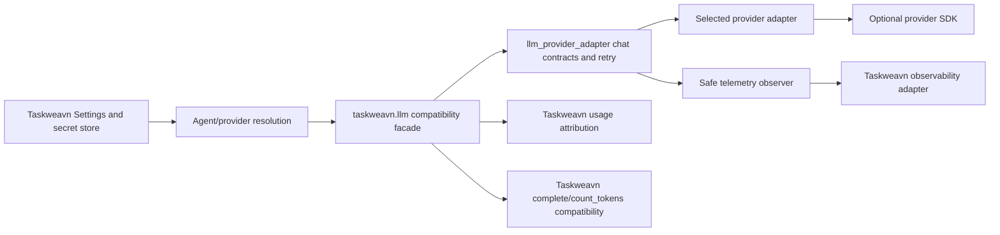

# Standalone LLM Provider Package Technical Design

> Status: F2 design accepted; release decisions confirmed for F4 implementation
>
> Branch: `codex/llm-provider-package`
>
> Last Updated: 2026-08-09
>
> Requirements: [Standalone LLM Provider Package Requirements](llm-provider-package-requirements.md)
>
> Related Architecture: [LLM Provider Reliability](../../architecture/llm-provider-reliability.md)
>
> Source Repository: `https://github.com/zhanghao1903/llm-provider-adapter`

## 1. Design Summary

The authoritative provider implementation will move from `taskweavn.llm` into
the standalone `zhanghao1903/llm-provider-adapter` repository. The package owns
provider-neutral synchronous chat contracts, provider transports, protocol
conversion, response normalization, safe errors, bounded retry, catalog data,
and a framework-neutral telemetry observer. Taskweavn remains the product
integration layer for Settings, secrets, Agent profile resolution, usage
attribution, observability, Action schemas, and OpenHands compatibility.

The migration is release-gated rather than source-gated: Taskweavn will not
switch until an external wheel and sdist have passed clean-environment checks
and a public package version has been published. Taskweavn then consumes a
bounded distribution requirement and an exact lock entry. It never imports a
repository-relative checkout or keeps a second provider implementation.

The user confirmed the distribution name `llm-provider-adapter`, import package
`llm_provider_adapter`, MIT license, and first version `0.1.0` on 2026-08-09.
The user also explicitly authorized TestPyPI validation and publication of the
same verified artifacts to public PyPI after that validation succeeds.



## 2. Current-State Evidence

### 2.1 Repository and source ownership

- Taskweavn is on `codex/llm-provider-package` at the confirmed requirements
  snapshot `4406f72f6e944e64e543f016da48283d7dfbdd7d`.
- `zhanghao1903/llm-provider-adapter` is public, unarchived, writable by the
  current maintainer, uses `main` as its default branch, and is empty at the
  time of this design.
- No external distribution is currently declared or locked by Taskweavn.

### 2.2 Existing module inventory

| Current module | Current responsibility | Target owner |
|---|---|---|
| `taskweavn.llm.contracts` | chat contracts plus OpenHands placeholders | chat-only contracts move out; OpenHands placeholders stay in Taskweavn |
| `taskweavn.llm.errors` | normalized provider errors | external package |
| `taskweavn.llm.retry` | retry, error classification, delay, retry records | external package |
| `taskweavn.llm.provider_catalog` | provider IDs, endpoints, credential env names, URL validation | external package; Taskweavn may re-export |
| `taskweavn.llm.providers.*` | five transports, request conversion, parsers | external package only |
| `taskweavn.llm.logging` | provider events and Taskweavn Agent I/O logs | safe observer moves out; Taskweavn log projection stays |
| `taskweavn.llm.config` | environment resolution and provider construction | Taskweavn owns env resolution; provider factory comes from package |
| `taskweavn.llm.client` | chat facade, OpenHands compatibility, Action tool schema helpers | Taskweavn thin facade and business helpers stay |
| `taskweavn.llm.agent_config` | Agent role/profile inheritance | Taskweavn |
| `taskweavn.llm.agent_resolver` | Settings, secrets, usage and Agent runtime assembly | Taskweavn |

The current tree has about 1,997 lines in top-level LLM modules and 1,087
lines under `providers/`. Individual files are below the 800-line hotspot
threshold, but the package tree mixes six responsibility groups and is broadly
imported by runtime, server, audit, collaborator, CLI, risk, and usage code.

### 2.3 Behavior that must remain stable

- Synchronous `chat()` is the only contract extracted in version 0.x.
- OpenAI-shaped messages and tool schemas remain the caller-facing wire model.
- OpenAI and Claude use their official SDKs; DeepSeek uses the OpenAI-compatible
  SDK path; OpenRouter and LiteLLM retain their current LiteLLM paths.
- SDK retries remain disabled and one package-owned retry policy remains the
  only automatic retry owner.
- A configured request timeout retains the existing per-attempt hard-failure
  semantics; a timeout is not silently replayed because upstream acceptance or
  billing may be unknowable.
- Unsupported capabilities fail explicitly rather than dropping request data.
- Taskweavn still supplies `complete()` and `count_tokens()` through OpenHands.

## 3. Ownership Boundary

### 3.1 External package owns

1. Frozen provider-neutral request, response, usage, tool call, capability,
   retry, and safe metadata models.
2. A synchronous `LLMProvider.chat(request)` protocol.
3. Provider constructors and an explicit provider factory/config contract.
4. OpenAI, Claude, DeepSeek, OpenRouter, and LiteLLM transports.
5. Provider-specific request conversion and response parsing.
6. Error classification, safe public exceptions, retry records, backoff, and
   timeout behavior.
7. Provider IDs, default endpoints, credential-key hints, capability metadata,
   and endpoint validation.
8. A no-op-by-default telemetry observer seam that exposes safe summaries.
9. Optional provider extras, build metadata, compatibility policy, changelog,
   support matrix, examples, and package release automation.

### 3.2 Taskweavn owns

1. Environment and Settings projection, encrypted/write-only secrets, and
   readiness UI/API behavior.
2. Agent role/profile inheritance and runtime provider selection.
3. Workspace, Session, Plan, Task, and Agent usage attribution and persistence.
4. Product logs, Audit, diagnostics, and conversion of safe package telemetry
   into Taskweavn log records.
5. `Action`/`Observation`, Action-to-tool-schema conversion, and tool argument
   handling.
6. Business callers including AgentLoop, Router, Collaborator, and Audit Agent.
7. OpenHands `complete()` and `count_tokens()` compatibility.
8. A one-minor compatibility facade under `taskweavn.llm`.

### 3.3 Forbidden dependencies

The external package must not import Taskweavn, OpenHands, a UI toolkit, a
database layer, Taskweavn observability, or Taskweavn domain models. Taskweavn
must not retain provider SDK construction, provider-specific payload shaping,
or response parsing after cutover.

## 4. Public Contract Design

Public contracts below are exported from `llm_provider_adapter`.

### 4.1 Request models

`ChatRequest` remains frozen and strict and contains:

- `model: str`;
- `messages: list[dict[str, Any]]`;
- optional `tools` and `tool_choice`;
- optional `temperature`, `max_tokens`, and positive `timeout_seconds`;
- optional `ThinkingConfig` and `ProviderRoutingConfig`;
- `provider_options: Mapping[str, JSONValue]` for explicitly documented escape
  hatches, rejected by providers that do not declare support;
- caller metadata retained for correlation but never emitted wholesale.

The package validates cross-field capability requirements before transport.
Unknown top-level fields remain forbidden. Provider-specific options are never
silently ignored.

### 4.2 Response models

`ChatResponse` provides stable fields for:

- `content`, `reasoning_content`, and `tool_calls`;
- `finish_reason`;
- `provider_name` and `model_name`;
- `provider_request_id`;
- normalized `LLMUsage`, including cached/reasoning token fields;
- `retry_count` and immutable `retry_records`;
- safe `raw_response_metadata` containing only allow-listed scalar identifiers
  and status metadata.

Unavailable optional fields are `None`; unavailable collections are empty.
Provider SDK response objects and full payloads are never returned.

### 4.3 Provider protocol

```python
class LLMProvider(Protocol):
    name: str
    capabilities: ProviderCapabilities

    def chat(self, request: ChatRequest) -> ChatResponse: ...
```

`complete()` and `count_tokens()` are intentionally absent. Taskweavn adapts
the package protocol into its broader legacy facade.

### 4.4 Provider construction

Provider constructors accept explicit credentials, endpoints, retry policy,
observer, and injectable SDK clients/factories for deterministic tests. A
small `create_provider(provider_id, config)` factory may centralize missing
extra checks, but it must not read process environment or persist secrets.

Each missing SDK raises `MissingProviderExtraError` before any network call and
names the required extra without attempting an implicit installation.

## 5. Error, Retry, Timeout, and Security Contracts

### 5.1 Error taxonomy

The external package owns stable public exceptions for configuration,
authentication, invalid request, unsupported capability, context limit,
rate-limit/retry exhaustion, transport failure, and missing extras. Each error
contains provider, model, classification, retry records, and allow-listed safe
metadata.

Raw SDK exception text, repr, request body, response body, headers, API keys,
and authorization values are not stored on or interpolated into public errors.
The package may derive an internal classification from the SDK exception but
must discard unsafe source details after extracting allow-listed fields.

### 5.2 Retry owner

- The package base provider is the sole retry owner.
- SDK retry is configured to zero when supported.
- Only classifications declared retryable by `RetryPolicy` are retried.
- Fatal auth, request, capability, and context failures do not retry.
- Retry records are ordered, immutable, safe, and returned on success or
  attached to the normalized terminal error.
- No provider switch, hedging, or hidden replay is allowed.

### 5.3 Timeout

`timeout_seconds` is passed to the SDK call. Consistent with the current
Taskweavn contract, a timeout with an explicit/default timeout does not trigger
another package attempt. Documentation states that timeout does not prove the
upstream request was not accepted or billed.

### 5.4 Telemetry observer

The package defines a synchronous observer protocol with a single
`on_event(event)` method and immutable event variants for request, response,
retry, and error. Events contain counts, provider/model, timeout, capability
flags, request ID, normalized usage, retry classification/delay, status code,
and safe error type. They contain no messages, tool arguments, credentials,
headers, raw payloads, arbitrary request metadata, or raw exception text.

Observer failures are contained and never change the provider call outcome.
The default observer is a no-op. Taskweavn supplies an adapter that maps these
events into its existing structured provider logs; application-level full LLM
I/O logging remains wholly inside Taskweavn and under its existing policy.

## 6. Provider and Dependency Matrix

| Provider | Transport owner | Extra | Core behavior to prove |
|---|---|---|---|
| OpenAI | official `openai` SDK | `openai` | tools, usage, request ID, reasoning effort, custom endpoint |
| Claude | official `anthropic` SDK | `claude` | system/messages/tool conversion, usage/cache parsing, explicit unsupported thinking |
| DeepSeek | `openai` compatible SDK | `deepseek` | chat/reasoner profiles, reasoning input rules, tools/capabilities |
| OpenRouter | current LiteLLM-compatible path | `openrouter` | provider routing object, no implicit fallback |
| LiteLLM | `litellm` SDK | `litellm` | generic compatibility entry, normalized output |

Extras may share a dependency but remain separately installable names so users
can request the provider they intend to use. An `all` extra is additive. Core
depends only on Python 3.11+, Pydantic, and small runtime utilities justified
by the final package lock.

## 7. Source and Module Layout

After the naming gate, the external repository will use a `src` layout:

```text
llm-provider-adapter/
  pyproject.toml
  README.md
  LICENSE
  CHANGELOG.md
  src/llm_provider_adapter/
    __init__.py
    contracts.py
    errors.py
    telemetry.py
    retry.py
    catalog.py
    factory.py
    providers/
      openai.py
      claude.py
      deepseek.py
      openrouter.py
      litellm.py
      _openai_compat.py
      _anthropic_compat.py
  tests/
  examples/
```

Taskweavn retains:

```text
src/taskweavn/llm/
  __init__.py              # deprecated public re-exports and Taskweavn facade
  client.py                # chat adaptation plus OpenHands compatibility
  config.py                # env/settings projection into explicit package config
  telemetry.py             # safe package event -> Taskweavn logger
  logging.py               # application-level Agent I/O logs only
  agent_config.py
  agent_resolver.py
  providers/*.py           # temporary pure re-export wrappers only
```

The provider wrappers contain imports and deprecation metadata only. They are
kept through one Taskweavn minor compatibility window and are removed no
earlier than Taskweavn `0.3.0`, subject to the release version chosen for the
migration.

## 8. Data Flow and Lifecycle

1. Taskweavn Settings/Agent resolver selects provider, model, endpoint, and
   credential and creates a package provider with the Taskweavn observer.
2. `taskweavn.llm.LLMClient.chat()` converts its legacy call arguments into the
   external `ChatRequest` without exposing Taskweavn domain objects.
3. The package validates request fields and declared capabilities.
4. The provider emits a safe request event and executes one SDK call with SDK
   retries disabled.
5. Retry logic classifies failures and either emits a safe retry event or raises
   a normalized safe error.
6. The provider parser returns a normalized `ChatResponse` and emits a safe
   response event.
7. Taskweavn usage wrapper attributes the normalized usage to product entities;
   the package does not know those identities.
8. Taskweavn Agent loops consume the same response and tool call shape they use
   before migration.

No package state is persisted. Provider instances may lazily hold an SDK client
but must not share request mutation across calls. The synchronous contract does
not claim thread safety; each request object and response is immutable at the
model boundary.

## 9. Compatibility and Migration

### 9.1 Additive compatibility stage

The first external release proves contract parity while Taskweavn still owns
its current implementation. No Taskweavn cutover occurs from a local checkout.

### 9.2 Published dependency cutover

After package release proof, Taskweavn declares
`llm-provider-adapter>=0.1.0,<0.2.0`, and `uv.lock` records the exact registry
artifact and hashes.

### 9.3 Compatibility facade

Existing `taskweavn.llm` names and `taskweavn.llm.providers.*` imports continue
to resolve through pure re-exports for one minor version. `LLMClient`,
`LazyLLMClient`, `tool_schema_from_action`, and `parse_tool_arguments` remain
Taskweavn-owned. New external consumers import only the external namespace.

### 9.4 Removal rule

Provider implementation files are deleted in the same Taskweavn cutover that
adds the external dependency. A repository scan must prove no SDK construction,
provider payload conversion, or response parser remains. Re-export wrappers
are explicitly exempt until their documented removal version.

## 10. Rollout and Rollback

Rollout order is fixed:

1. decide distribution/import name and license;
2. initialize the external repository on a feature branch;
3. implement and independently verify the package;
4. build wheel/sdist and run clean-environment core and per-extra checks;
5. obtain explicit publication authorization, validate on TestPyPI, and publish
   a public 0.x release;
6. migrate Taskweavn to the bounded registry dependency;
7. run package-boundary integration and the full Taskweavn regression gate;
8. prepare reviewable PRs and merge only under each repository's authorization.

Before Taskweavn cutover, rollback is to leave its dependency and source
unchanged. After cutover, rollback pins the last verified external version and
regenerates the lock; it never restores copied provider source. If no earlier
external version exists, the Taskweavn migration cannot merge until the first
release is proven stable.

## 11. Test and Proof Strategy

### 11.1 External package

- model validation and stable null semantics;
- provider capability and preflight rejection tests;
- parser fixtures for text, tools, finish reason, usage/cache/reasoning,
  provider/model, request ID, and safe metadata;
- retryable/non-retryable/timeout fixtures with deterministic sleeper/random;
- secret canary tests across exceptions, telemetry, logs, and repr;
- missing-extra tests in isolated environments;
- provider fake-client tests with SDK retry disabled assertions;
- Python 3.11 and current supported Python matrix;
- Ruff, strict Mypy, Pytest, wheel/sdist build and metadata checks;
- clean venv installation of core, each provider extra, and `all`;
- README example executed offline with a fake client.

### 11.2 Taskweavn

- preserve the confirmed 76-test LLM/Settings/Agent resolver baseline;
- add package-boundary integration tests using only installed external imports;
- prove Settings and Agent resolver construct external providers;
- prove safe telemetry reaches current Taskweavn provider logs;
- prove usage attribution and Agent loops preserve response semantics;
- prove OpenHands `complete()`/`count_tokens()` remain available;
- scan source for duplicated SDK clients, conversions, and parsers;
- run targeted Ruff/Mypy, full backend tests, and repository-required CI.

### 11.3 Release evidence

Evidence records exact source commit, artifact hashes, TestPyPI/public package
coordinates, clean-environment commands, Taskweavn lock entry, both PR heads,
review results, merge SHAs, and rollback version. Secrets and local credential
files are never included.

## 12. Cross-Repository Change Choreography

The external package repository is the first dependency in the sequence and
must have its own branch, commits, PR, checks, and review evidence. Taskweavn's
lifecycle branch contains only product-side design, plan, dependency, adapter,
tests, and traceability; it never carries external package source.

An external package PR may be reviewed before publication, but Taskweavn's PR
cannot reach review-ready state until a released artifact exists and its exact
version is locked. Conversely, the external package release must not claim
Taskweavn integration proof until the consumer migration tests pass. The final
trace record links both immutable heads and distinguishes package proof from
consumer proof.

## 13. Decisions and Gates

| Gate | Required evidence | State |
|---|---|---|
| Requirements handoff | confirmed document/commit/hash accepted by lifecycle | satisfied |
| Source repository | public empty target repository and maintainer permission | satisfied |
| F2 boundary | ownership, API, errors, telemetry, migration, rollback, proof | satisfied by this design |
| Public names | `llm-provider-adapter` / `llm_provider_adapter` | confirmed 2026-08-09 |
| License | MIT | confirmed 2026-08-09; file pending implementation |
| Publication | TestPyPI validation, then same artifacts to PyPI | explicitly authorized 2026-08-09 |
| Taskweavn cutover | released artifact, clean-env proof, bounded constraint and exact lock | not yet satisfied |
| Merge/release closure | independently reviewed exact heads and authoritative merge/release facts | not yet satisfied |

## 14. Requirement Traceability

| Requirement group | Design sections |
|---|---|
| REQ-001, REQ-002, REQ-014, REQ-016, REQ-019 | 1, 7, 9, 10, 12 |
| REQ-003, REQ-004, REQ-005, REQ-018 | 4, 6, 9 |
| REQ-006, REQ-007, REQ-010 | 5, 11 |
| REQ-008, REQ-009 | 3, 4, 6 |
| REQ-011, REQ-012, REQ-013, REQ-017 | 2, 3, 8, 9 |
| REQ-015 | 7, 11 |

## 15. Design Acceptance

F2 is complete and its release decisions are resolved. F4 may initialize the
authoritative external repository and create the confirmed public namespace.
